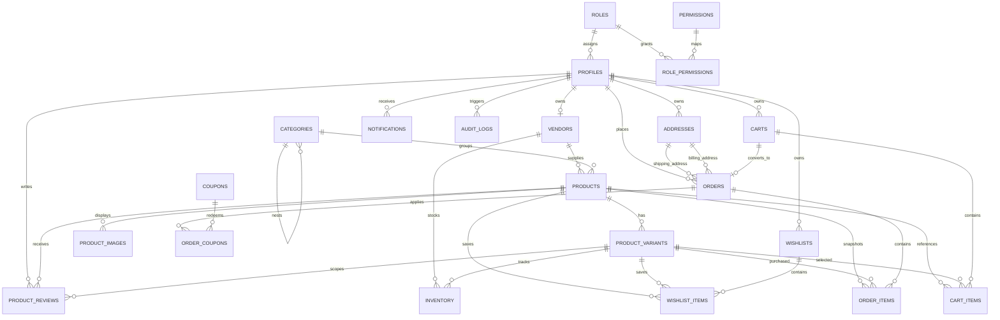

# ERD

## Purpose

This document provides a readable entity relationship diagram for the current schema after:

- `001_initial_core_ecommerce_schema.sql`
- `002_ecommerce_extensions.sql`
- `003_add_variant_references_to_cart_and_order_items.sql`

## Entity Relationship Diagram

## Relationship Notes

- `profiles` extends `auth.users` and acts as the operational user record.
- `products` is still the main catalog and commerce reference in MVP.
- `product_variants` now support cart and order item references, while `variant_id` remains nullable for backward compatibility.
- `inventory` is already variant-based.
- `vendors` is introduced now for future multi-vendor expansion, but order and cart ownership remain platform-centric in the current schema.
- `product_images.image_url` references the Supabase Storage `product-images` bucket.

## Implementation Warning

`variant_id` is now available in both `cart_items` and `order_items`, but remains nullable for backward compatibility.

Application and checkout validation should require `variant_id` whenever a product has variants.
